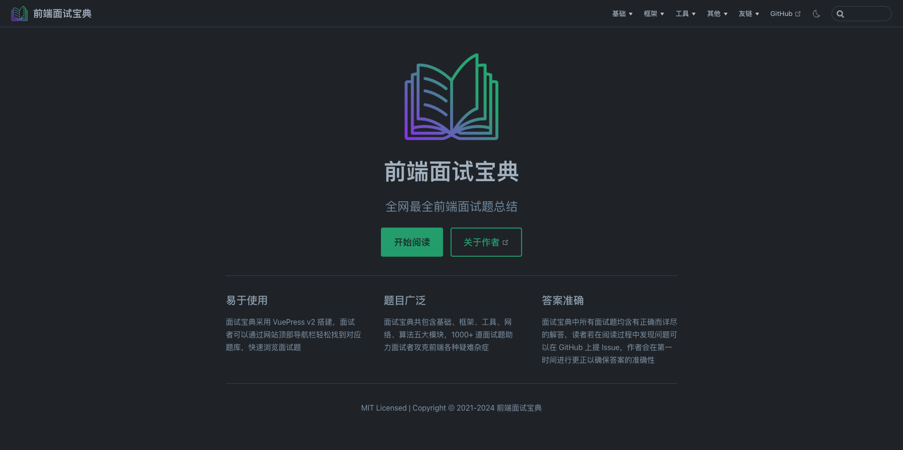

<p align="center">
    
</p>
<h1 align="center">
    前端面试宝典
</h1>
<p align="center">
    📓 全网最全前端面试题总结
</p>
<div align="center">
    
    
    
    
    
</div>

## 👋 项目简介

虽然市面上前端面试题库有很多，但质量却参差不齐，有些面试题库存在题目不全面、题解不详细甚至错误等问题。为帮助前端面试者更好地准备面试，本「前端面试宝典」应运而生。

## 💡 项目特点

易于使用：面试宝典采用 VuePress v2 搭建，面试者可以通过网站顶部导航栏轻松找到对应题库，快速浏览面试题。

题目广泛：面试宝典共包含基础、框架、工具、网络、算法五大模块，1000+ 道面试题助力面试者攻克前端各种疑难杂症。

答案准确：面试宝典中所有面试题均含有正确而详尽的解答，读者若在阅读过程中发现问题可以在 GitHub 上提 Issue，作者会在第一时间进行更正以确保答案的准确性。

## 🖥 项目截图



## 🚀 项目运行

安装依赖：
```shell
npm install
```
启动项目：
```shell
npm run docs:dev
```
打包项目：
```shell
npm run docs:build
```
