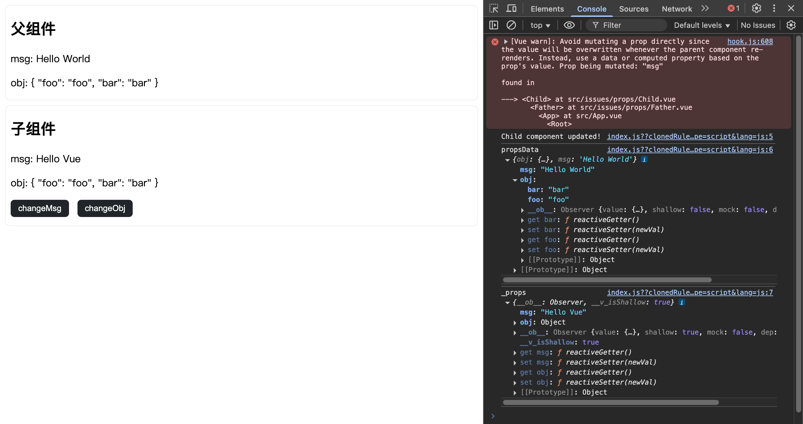
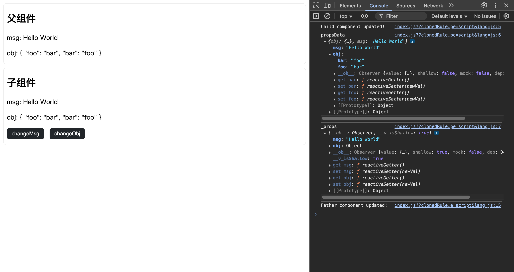

# Vue

## 1. Vue 组件为何不能修改 props？

### 问题解析

实际上，Vue 组件可以修改 props，只是会报 Vue warn，但是此 props 非彼 props。父组件传递过来的 props 保存在子组件的 `$options.propsData` 属性当中，子组件自身维护的 props 保存在私有属性 `_props` 当中。
当父组件传递过来的 props 是**基本数据类型**时，`_props` 中保存的是其值，此时子组件修改 props 实际上修改的是 `_props` 中的值，而 `$options.propsData` 中的值不会改变，故不会对父组件产生任何影响。
当父组件传递过来的 props 是**引用数据类型**时, `_props` 中保存的是其址（引用，浅拷贝），此时子组件的 `_props` 和 `$options.propsData` 属性中保存的引用数据类型互相影响，从而产生不可估量的后果。

### [源码速览](https://github.com/vuejs/vue/blob/main/src/core/instance/state.ts)

```js
function initProps(vm: Component, propsOptions: Object) {
  const propsData = vm.$options.propsData || {}
  const props = (vm._props = shallowReactive({}))
  // cache prop keys so that future props updates can iterate using Array
  // instead of dynamic object key enumeration.
  const keys: string[] = (vm.$options._propKeys = [])
  const isRoot = !vm.$parent
  // root instance props should be converted
  if (!isRoot) {
    toggleObserving(false)
  }
  for (const key in propsOptions) {
    keys.push(key)
    const value = validateProp(key, propsOptions, propsData, vm)
    /* istanbul ignore else */
    if (__DEV__) {
      const hyphenatedKey = hyphenate(key)
      if (
        isReservedAttribute(hyphenatedKey) ||
        config.isReservedAttr(hyphenatedKey)
      ) {
        warn(
          `"${hyphenatedKey}" is a reserved attribute and cannot be used as component prop.`,
          vm
        )
      }
      defineReactive(
        props,
        key,
        value,
        () => {
          if (!isRoot && !isUpdatingChildComponent) {
            warn(
              `Avoid mutating a prop directly since the value will be ` +
                `overwritten whenever the parent component re-renders. ` +
                `Instead, use a data or computed property based on the prop's ` +
                `value. Prop being mutated: "${key}"`,
              vm
            )
          }
        },
        true /* shallow */
      )
    } else {
      defineReactive(props, key, value, undefined, true /* shallow */)
    }
    // static props are already proxied on the component's prototype
    // during Vue.extend(). We only need to proxy props defined at
    // instantiation here.
    if (!(key in vm)) {
      proxy(vm, `_props`, key)
    }
  }
  toggleObserving(true)
}
```

### 测试代码

Father.vue

```js
<template>
	<div>
		<div class="wrapper">
			<h2>父组件</h2>
			<p>msg: {{ msg }}</p>
			<p>obj: {{ obj }}</p>
		</div>
		<Child :msg="msg" :obj="obj"/>
	</div>
</template>

<script>
import Child from '@/issues/props/Child.vue';

export default {
	data() {
		return {
			msg: 'Hello World',
			obj: {
				foo: 'foo',
				bar: 'bar',
			},
		};
	},
	updated() {
		console.log('Father component updated!');
	},
	components: {
		Child,
	},
};
</script>

<style scoped>
.wrapper {
	padding: 0 8px;
	margin: 8px 0;
	border-radius: 8px;
	border: 1px solid #eee;
}
</style>
```

Child.vue

```js
<template>
	<div class="wrapper">
		<h2>子组件</h2>
		<p>msg: {{ msg }}</p>
		<p>obj: {{ obj }}</p>
		<button class="btn" @click="changeMsg">changeMsg</button>
		<button class="btn" @click="changeObj">changeObj</button>
	</div>
</template>

<script>
export default {
	props: ['msg', 'obj'],
    updated() {
        console.log('Child component updated!');
        console.log('propsData', this.$options.propsData);
        console.log('_props', this._props);
    },
	methods: {
		changeMsg() {
			this.msg = 'Hello Vue';
		},
		changeObj() {
			this.obj.foo = 'bar';
			this.obj.bar = 'foo';
		},
	},
};
</script>

<style scoped>
/* https://getbootstrap.com/docs/5.3/components/buttons/ */
button:not(:disabled) {
	cursor: pointer;
}
button:disabled {
	cursor: not-allowed;
}
.btn {
	border: 0;
	padding: 6px 12px;
	margin: 0 1em 1em 0;
	color: white;
	border-radius: 6px;
	background-color: #212529;
}
.btn:hover {
	background-color: #424649;
}
.btn:active {
	background-color: #4d5154;
}
</style>
```

### 运行结果

点击 changeMsg 按钮后运行结果如下：



点击 changeObj 按钮后运行结果如下：



::: note 参考资料

- [Daily-Interview-Question](https://github.com/Advanced-Frontend/Daily-Interview-Question/issues/60#issuecomment-518182290)

:::
